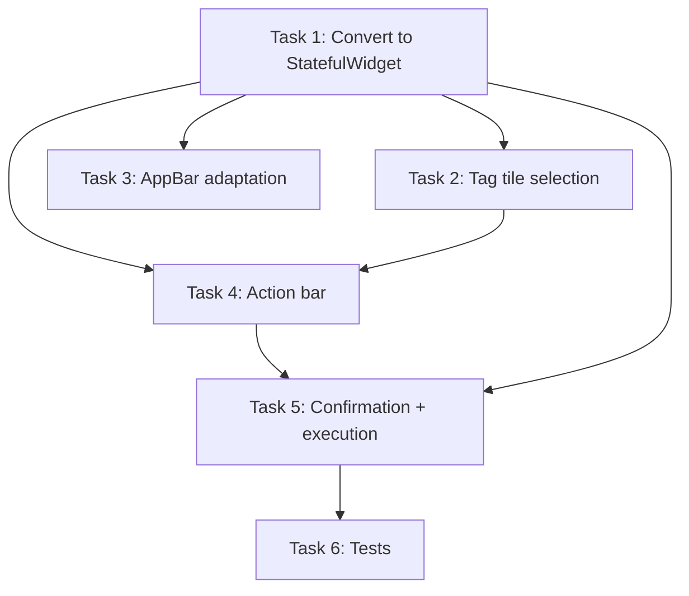

# Tasks: Delete Selected Tags

## Summary

Implement batch multi-select delete on the tag management screen. All changes are confined to `lib/ui/screens/tag_management_screen.dart` and its test file. No domain or infrastructure changes.

---

## Task 1: Convert TagManagementScreen to ConsumerStatefulWidget

**File**: `lib/ui/screens/tag_management_screen.dart`

**Changes**:
- Change `TagManagementScreen` from `ConsumerWidget` → `ConsumerStatefulWidget`
- Add `_TagManagementScreenState` class extending `ConsumerState<TagManagementScreen>`
- Add `final Set<String> _selectedTags = {}` state
- Add `bool get _isSelectionMode => _selectedTags.isNotEmpty`
- Add `void _toggleSelection(String tagName)` — add/remove from set via `setState`
- Add `void _clearSelection()` — clear set via `setState`
- Remove `WidgetRef ref` parameter from all existing screen methods (`_showAddTagDialog`) — they now use `ref` from `ConsumerState`
- Conver existing `build(BuildContext context, WidgetRef ref)` to `build(BuildContext context)` (stateful widget convention)

**Effort**: Small  
**Risk**: Low — purely structural; no behavioral change yet, selection state starts empty so existing UI renders identically

**Lines**: ~30 modified

---

## Task 2: Modify _TagSettingTile for selection mode interaction

**File**: `lib/ui/screens/tag_management_screen.dart`

**Changes**:
- Add constructor parameters: `isSelected`, `isSelectionMode`, `onToggle` (all optional, defaulted to `false`/`null`)
- Change user-tag `onLongPress` behavior:
  - **Normal mode**: long-press calls `onToggle` (enters selection mode, selects this tag) — replaces existing `_showDeleteConfirmation` call
  - **Selection mode**: long-press also calls `onToggle` (toggles, same as tap)
- Change user-tag `onTap` behavior:
  - **Normal mode**: existing rename dialog (unchanged)
  - **Selection mode**: calls `onToggle`
- Add checkbox overlay: when `isSelected`, render a `check_circle` icon positioned on the leading `CircleAvatar` using a `Stack`
- System tags unchanged (no new params, no selection, tap → color picker, long-press → no-op)

**Note**: This task replaces the old single-tag long-press delete behavior with entering selection mode. Single-tag delete is still available through the batch flow (select one tag → delete).

**Effort**: Medium  
**Risk**: Low — private widget, all callers in same file; long-press behavior change is deliberate per spec/proposal

**Lines**: ~30 modified

---

## Task 3: Adapt AppBar for selection mode

**File**: `lib/ui/screens/tag_management_screen.dart`

**Changes**:
- When `_isSelectionMode == true`:
  - Title: `"${_selectedTags.length} seleccionado(s)"` (singular/plural)
  - Leading: close icon (`Icons.close`) → calls `_clearSelection`
  - Actions: empty (hide add button)
- When `_isSelectionMode == false`:
  - Title: `'Gestionar etiquetas'` (existing)
  - Leading: default back arrow (existing, from `Navigator`)
  - Actions: add button (existing)

**Effort**: Small  
**Risk**: Low — purely conditional rendering, no new widgets

**Lines**: ~20 modified

---

## Task 4: Add _DeleteActionBar bottom widget

**File**: `lib/ui/screens/tag_management_screen.dart`

**Changes**:
- Add new private `_DeleteActionBar` class at file bottom (StatelessWidget)
- Props: `selectedCount`, `onDelete`, `onCancel`
- Layout: `Container` with top border, surface color, bottom padding for safe area → `Row` with:
  - Expanded `Text` — `"N tag(s) seleccionados"` (singular/plural in Spanish)
  - Cancel `IconButton` (`Icons.close`)
  - Delete `IconButton` (`Icons.delete`, error color)
- In screen's `build()`: wrap existing `tagsAsync.when(...)` body in a `Stack`; position `_DeleteActionBar` at bottom when `_isSelectionMode`

**Effort**: Small  
**Risk**: Low — new widget, no dependency on existing code

**Lines**: ~40 added

---

## Task 5: Add confirmation dialog and batch delete execution

**File**: `lib/ui/screens/tag_management_screen.dart`

**Changes**:
- Add `_showBatchDeleteConfirmation()`:
  - Read `tagUsageCountProvider` to compute total affected entries
  - Show `AlertDialog` with title `"¿Eliminar tag(s)?"`, content with tag count + entry count
  - Cancel → dismiss, stay in selection mode
  - Confirm → call `_executeBatchDelete()`
- Add `_executeBatchDelete()`:
  - Iterate `_selectedTags.toList()`:
    1. Call `deleteTagSettingProvider` use case
    2. Call `removeTagFromEntriesProvider`, collect returned entry IDs into a `Set<String>`
    3. On error: log, continue (partial failure)
  - After loop:
    - Invalidate `tagSettingsListProvider`
    - Invalidate `entryListProvider`
    - Invalidate `entryDetailProvider(id)` per unique affected ID
    - Call `_clearSelection()`
    - Show SnackBar with outcome (all succeeded / partial / all failed)

**Effort**: Medium  
**Risk**: Low — reuses existing use cases, no new domain logic; error handling per spec (R5)

**Lines**: ~70 added

---

## Task 6: Add widget tests for batch delete flow

**File**: `test/ui/screens/tag_management_screen_test.dart`

**Tests to add** (inspired by design.md testing strategy):
- `should_enter_selection_mode_on_long_press` — long-press user tag → selected state + action bar visible
- `should_toggle_selection_on_tap_in_selection_mode` — tap tag while in selection → toggles selected state
- `should_not_select_system_tags` — tap/system tag in selection mode → no change
- `should_exit_selection_via_back_button` — tap close icon → selection cleared, normal UI
- `should_exit_selection_on_last_deselect` — deselect last tag → exits automatically
- `should_update_count_in_action_bar` — select 1 then 2 → label updates
- `should_hide_action_bar_on_cancel` — tap cancel in action bar → selection cleared
- `should_show_batch_confirmation` — tap delete → confirmation dialog
- `should_stay_in_selection_on_cancel_confirmation` — cancel in confirmation → stays
- `should_show_snackbar_on_batch_delete` — confirm → SnackBar with success message
- `should_handle_partial_failure` — one tag throws → partial success SnackBar
- `should_handle_all_fail` — all tags throw → all-fail SnackBar

**Effort**: Medium  
**Risk**: Low — uses existing test infrastructure and stub patterns

**Lines**: ~120 new

---

## Dependencies

| From | To | Reason |
|------|----|--------|
| Task 1 | Task 2 | Tiles need `_selectedTags`, `_isSelectionMode`, `_toggleSelection` from state |
| Task 1 | Task 3 | AppBar needs `_isSelectionMode`, `_selectedTags.length`, `_clearSelection` |
| Task 1 | Task 4 | Action bar needs `_isSelectionMode`, `_selectedTags.length` |
| Task 1 | Task 5 | Batch delete needs `_selectedTags`, `_clearSelection` |
| Task 2 | Task 4 | User must select tags (Task 2) before action bar appears (Task 4) |
| Task 4 | Task 5 | Delete button in action bar triggers confirmation dialog |
| Task 5 | Task 6 | Tests must verify batch delete execution |

**Implementation order**: 1 → 2 → 3 → 4 → 5 → 6  
Tasks 2, 3 can be done in parallel after Task 1 (but all modify the same file, so sequential is safer for merge conflicts).

---

## Estimated Lines Changed

| File | Lines Modified | Lines Added | Risk |
|------|---------------|-------------|------|
| `lib/ui/screens/tag_management_screen.dart` | ~60 | ~110 | Low |
| `test/ui/screens/tag_management_screen_test.dart` | ~0 | ~120 | Low |
| **Total** | **~60** | **~230** | **Low** |

**Total: ~290 lines** (within 400-line budget for a single PR).

---

## Files to Touch

| File | Change Type |
|------|-------------|
| `lib/ui/screens/tag_management_screen.dart` | Modify |
| `test/ui/screens/tag_management_screen_test.dart` | Modify |

No new files, no domain/infrastructure changes.
